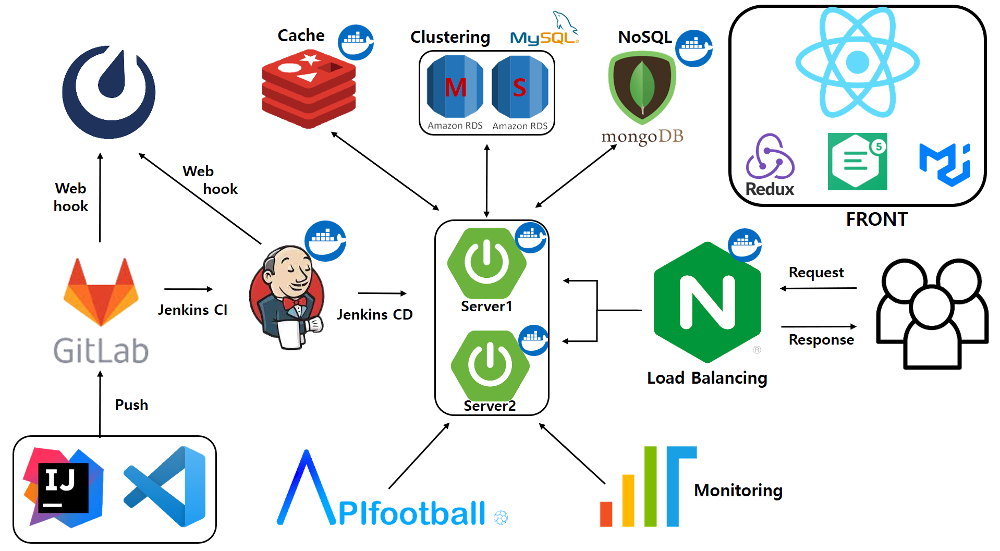
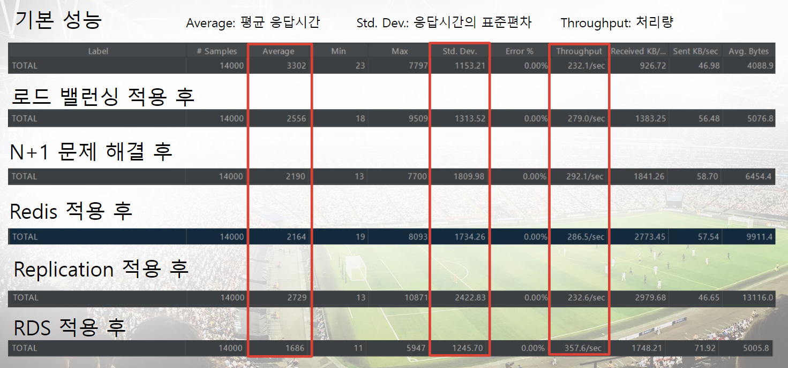
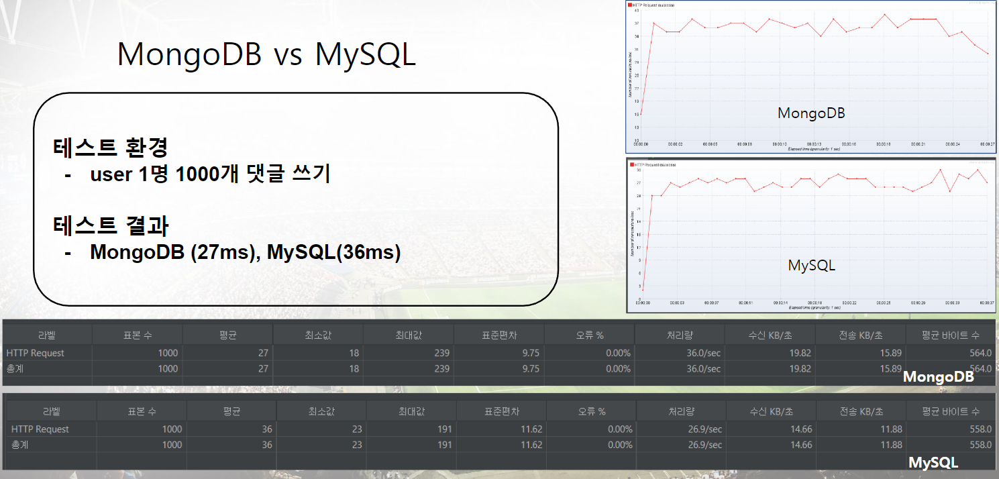

# 자율프로젝트 : 축잘알

   
  
   
  <h1>서비스 개요</h1>
   

## 목차

1. [**서비스 소개**](#1)
2. [**기술 스택**](#2)
3. [**시스템 아키텍처**](#3)
4. [**주요기능 및 데모영상**](#4)
5. [**UCC 보러가기**](#5)
6. [**협업 관리**](#6)
7. [**개발 멤버 소개**](#7)
8. [**프로젝트 기간**](#8)
9. [**프로젝트 관련 문서**](#9)

 

## 💡 서비스 소개

### 서비스 모토

> 축구를 안다고 하는 이들 모두 모여 최고를 가려라

#### 서비스에 대한 한마디

축구 경기와 선수들을 사용자가 추측을 하여 재미를 챙길 수 있는 서비스입니다.

특정 시간에 과도한 트래픽이 몰리는 스포츠 사이트의 문제점을 해결하기 위하여 대규모 트래픽을 소화할 수 있는 서버를 구축하였습니다.

 

## 🛠️ 기술 스택

 

 

 

 

 <b> 상세 기술스택 및 버전</b> 

| 구분            | 기술스택            | 상세내용               | 버전        |
| ------------- | --------------- | ------------------ | --------- |
| 공통            | 형상관리            | Gitlab             | \-        |
|               | 이슈관리            | Jira               | \-        |
|               | 커뮤니케이션          | Mattermost, Notion | \-        |
| BackEnd       | DB              | RDS(MySQL)         | -         |
|               |                 | MySQL              | -         |
|               |                 | JPA                | \-        |
|               |                 | MongoDB            | 6.0.2     |
|               |                 | Redis              | 7.0.5     |
|               | Java            | Zulu               | 8.33.0.1  |
|               | Spring          | Spring             | 5.3.6     |
|               |                 | Spring Boot        | 2.4.5     |
|               | IDE             | IntelliJ           | 2022.1.3  |
|               | Cloud Storage   | AWS S3             | \-        |
|               | Build           | Gradle             | 7.3.2     |
|               | API Docs        | Postman            |           |
| SmartContract |                 | Solidity           | ^0.8.4    |
|               | IDE             | Remix              | 0.26.3    |
| FrontEnd      | HTML5           |                    | \-        |
|               | CSS3            |                    | \-        |
|               | JavaScript(ES6) |                    | \-        |
|               | React           | React              | 18.2.0    |
|               |                 | Redux              | 8.0.4     |
|               | Node.js         |                    | 16.17.0   |
|               | Web3.js         |                    | ^1.8.0    |
|               | IDE             | Visual Studio Code | 1.70.0    |
| Server        | 서버              | AWS EC2(기본)        | \-        |
|               |                 | AWS EC2(추가)        | -         |
|               | 플랫폼             | Ubuntu             | 20.04 LTS |
|               | CI/CD           | Docker             | 20.10.21  |
|               |                 | Jenkins            | 2.361.2   |

 

## 🗂️ 시스템 아키텍처

| 시스템 구성                      |
|:---------------------------:|
|  |

 

## 🖥️ 주요기능

### 소셜 로그인

- 

### 마이페이지

- 

### 게시글 쓰기
- 

| 마이페이지                      |
|:--------------------------:|
|  |

### 경기 정보 페이지

- 

### 팀 정보 페이지

-

### 선수 정보 페이지

-

## 성능 개선

###  Jmeter 결과
 

### MySQL vs MongoDB
 

## 🎥 [UCC 보러가기](./assets/자율PJT_서울_2반_A203_UCC경진대회.MP4)

 

## 👥 협업 관리

| Jira BurnDown Chart          |
|:----------------------------:|
|  |

| Notion                                                  |
|:-------------------------------------------------------:|
|  |

 

## 👪 개발 멤버 소개

<table>
    <tr>
        <td height="140px" align="center"> <a href="https://github.com/깃허브 링크">
                👑 고동훤  (Back-End) </a>  </td>
        <td height="140px" align="center"> <a href="https://github.com/깃허브 링크">
                🙂 고태희  (Back-End) </a>  </td>
        <td height="140px" align="center"> <a href="https://github.com/깃허브 링크">
                😆 김경환  (Back-End) </a>  </td>
        <td height="140px" align="center"> <a href="https://github.com/fe26min">
                😁 박철민  (Back-End) </a>  </td>
        <td height="140px" align="center"> <a href="https://github.com/깃허브 링크">
                😶 양택훈  (Back-End) </a>  </td>
           <td height="140px" align="center"> <a href="https://github.com/깃허브 링크">
                😶 홍석인  (Back-End) </a>  </td>    
</tr>
    <tr>
        <td align="center">FULL STACK React Spring </td>
        <td align="center">FULL STACK React Spring </td>
        <td align="center">FULL STACK React Spring </td>
        <td align="center">FULL STACK React Spring</td>
        <td align="center">FULL STACK React Spring  </td>
        <td align="center">FULL STACK React Spring  </td>
  </tr>
</table>d>
    </tr>
</table>

 

## 📆 프로젝트 기간

### 22.10.11 ~ 22.11.21

- 기획 및 설계 : 22.10.11 ~ 22.10.09
- 프로젝트 구현 : 22.10.10 ~ 22.11.11
- 버그 수정 및 산출물 정리 : 22.11.11 ~ 22.11.21

 

## 📋 프로젝트 관련 문서

| 구분      | 링크                                                                                                                      |
|:------- |:-----------------------------------------------------------------------------------------------------------------------:|
| 피그마  | [피그마 바로가기](https://www.figma.com/file/PexqqvH6QoK6HjDrh46UGj/%EC%9E%90%EC%9C%A8?node-id=0%3A1) |
| ERD     | [ERD 바로가기](https://www.erdcloud.com/d/S5d5kSgr8RE7bzMLb)                                                                |
| 빌드/배포   | [빌드/배포 바로가기](/exec/포팅매뉴얼.pdf)                                                                                |
| 시연 시나리오 | [시연 시나리오 바로가기](/exec/시연 시나리오.pdf)                                                                                       |
| 발표자료    | [발표자료 바로가기](/exec/발표자료.pptx)                                                                                            |
